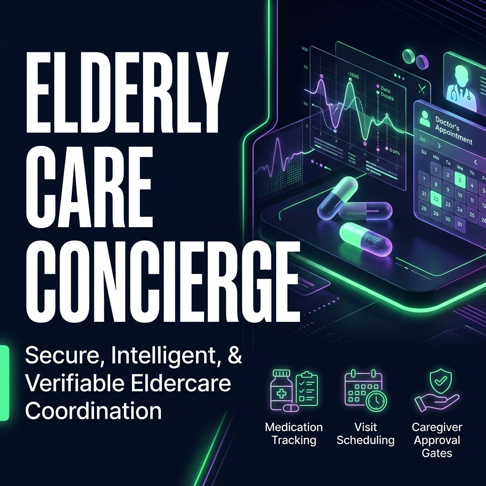
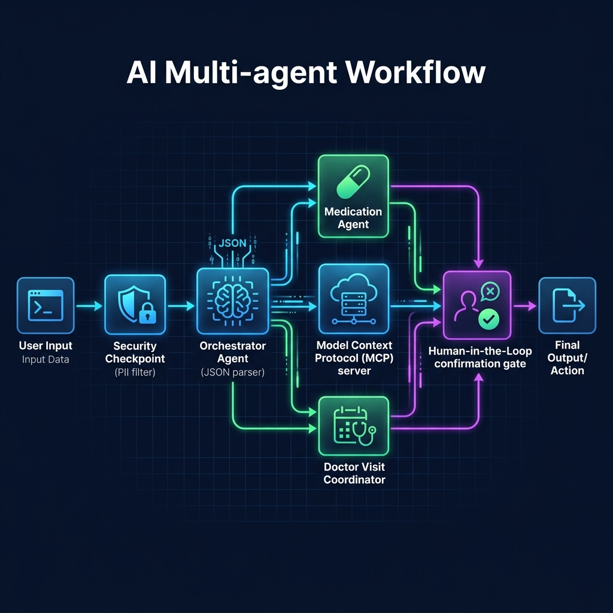
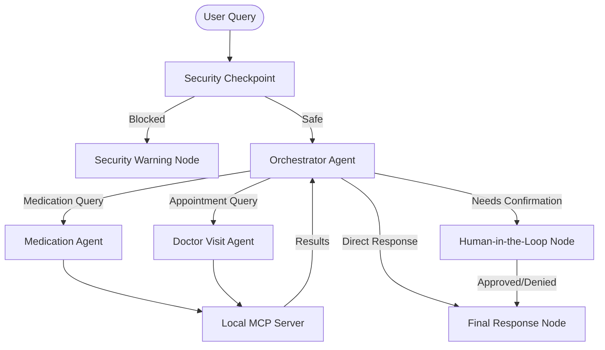

# Elderly Care Concierge - Submission Writeup

An AI-driven personal assistant designed to help elderly patients manage their daily care routine, specifically targeting medication tracking and doctor visit coordination. It combines a reassuring conversational tone with strict security controls and Human-in-the-Loop validation.

---

## 1. Design & Core Philosophy

The primary objective of the **Elderly Care Concierge** is to reduce cognitive load and health management anxiety for seniors. The system design prioritizes:
- **Warm & Empathetic Conversational Interface**: All sub-agents are prompted to communicate using a warm, clear, and patient tone.
- **Task Specialization**: Delegating complex functions to dedicated agents to ensure maximum accuracy and reliability.
- **Safety First**: Proactive screening of requests to catch safety risks (e.g. self-medication changes) and safeguard personal information.

---

## 2. Architecture & Tech Stack

The application is built on top of the **Google Agent Development Kit (ADK)** using a multi-agent workflow architecture.

### Components:
1. **Security Checkpoint (Pre-processing Node)**: Inspects the incoming raw text before any LLM invocation to scrub PII and filter out unsafe commands or unauthorized medical adjustments.
2. **Orchestrator Agent (`orchestrator_agent`)**: Analyzes the query intent and coordinates the flow, calling sub-agents as tools to retrieve data or perform actions.
3. **Medication Agent (`medication_agent`)**: A specialized sub-agent that interacts with the Model Context Protocol (MCP) server to fetch active prescriptions and log daily intakes.
4. **Doctor Visit Coordinator (`doctor_visit_agent`)**: A specialized sub-agent that checks upcoming doctor schedules and drafts checkup proposal objects.
5. **Model Context Protocol (MCP) Server**: A secure local server (`app/mcp_server.py`) exposing core system tools for managing stateful data (e.g. listing medications, logging intakes, scheduling appointments).

---

## 3. Human-in-the-Loop (HITL) Workflow

For critical operations like scheduling a new doctor's visit, the concierge implements a robust HitL confirmation workflow to prevent accidental bookings:
- **Dynamic Node Resumption**: Defined using the `@node(rerun_on_resume=True)` decorator.
- **Interrupts**: When a scheduling action is initiated, the workflow pauses and raises a `RequestInput` interrupt containing the booking proposal details.
- **Validation**: The conversation pauses until the user explicitly replies `yes` to finalize the appointment or `no` to discard it, logging the audit details.

---

## 4. Security, Privacy & Guardrails

Patient safety and data privacy are core pillars of the concierge architecture:
- **PII Scrubbing**: Automatic pre-processing filters scan for and redact Social Security Numbers (SSN), Credit Card numbers, Phone numbers, and Medical Record Numbers (MRN) to keep sensitive data from being sent to external LLMs.
- **Prompt Injection Defense**: Input text is scanned for override keywords (e.g., "ignore previous instructions"). Injection attempts trigger a security warning and immediately abort the run.
- **High-Risk Dosage Guardrails**: Restricted high-risk drug groups (such as Insulin, Warfarin, and strong opioids) cannot be modified or adjusted by user commands. Requests to modify these dosages are blocked at the Security Checkpoint with instructions to contact their doctor.

---

## 5. Impact & Future Scope

The Elderly Care Concierge empowers seniors to maintain their independence while keeping families and care providers informed:
- **Adherence Improvement**: Lowers the barrier to logging medication intake by using voice-like, warm text inputs.
- **Reduced Booking Friction**: Eliminates complex calendar UI interfaces by turning scheduling into a natural, guided conversation.
- **Future Integration**: The architecture easily extends to support EHR (Electronic Health Record) syncing, real-time family notification Webhooks, and emergency alert integrations.
